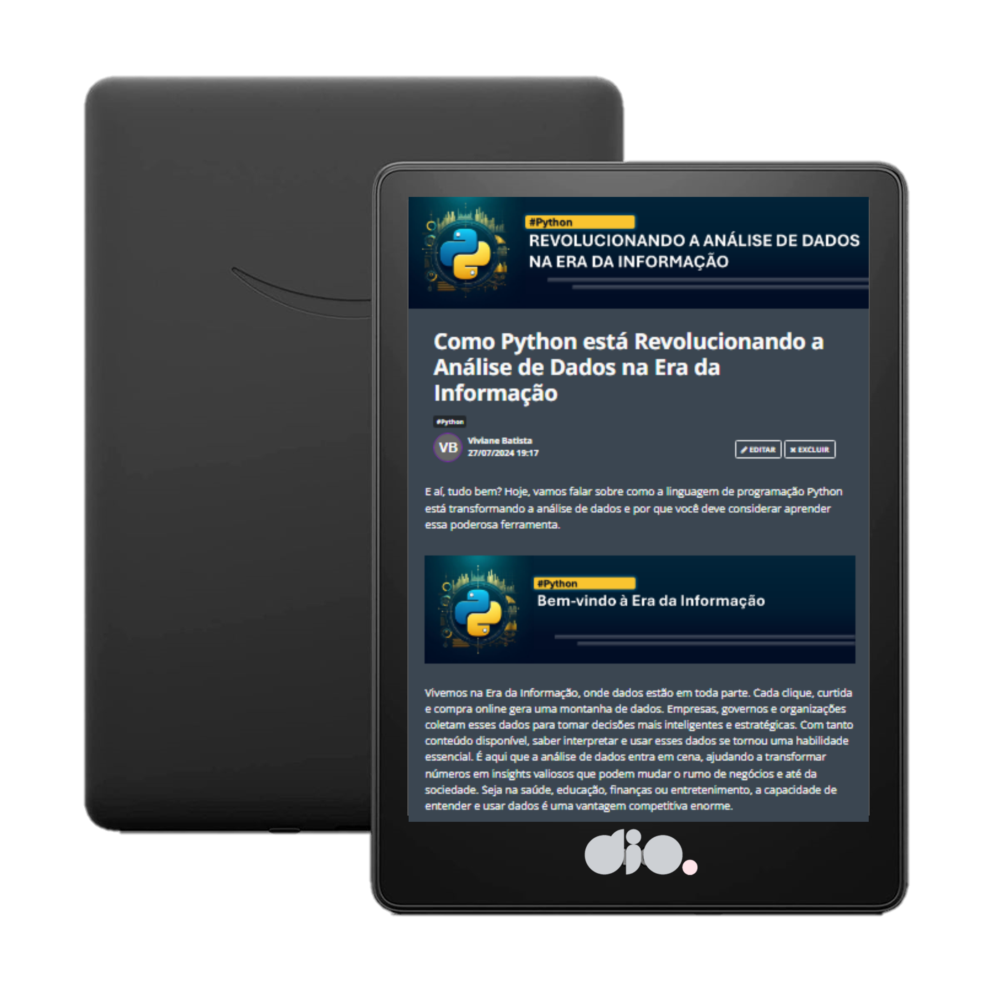

  

# Projeto artigo técnico gerado por I.A.s

 > ℹ️ **NOTE:** Este é o repositório desenvolvido durante um bootcamp na plataforma da Dio

Projeto com o objetivo de gerar um artigo técnico com um layout rico, leitura agradável e com foco em promover sua autoridade técnica.

<a href="https://web.dio.me/articles/como-python-esta-revolucionando-a-analise-de-dados-na-era-da-informacao?back=%2Farticles&open-modal=true&page=1&order=oldest" title="View PDF now"> 📕Clique aqui para ler o artigo</a>

## 💻 Tecnologias utilizadas no projeto

- [ChatGPT](https://chat.openai.com/) - para título e conteúdo
- [Copilot](https://copilot.microsoft.com/images/create) - para gerar imagens
- [PowerPoint](https://www.microsoft.com/en/microsoft-365/powerpoint) - Para formatação de banners e Layouts

## 📄 Prompts e ferramentas

ChatGPT：

|   Ação   | prompt                                                                                                                                                                                                                                                                         |
| :------: | ------------------------------------------------------------------------------------------------------------------------------------------------------------------------------------------------------------------------------------------------------------------------------ |
|  título  | Crie 10 headlines para nomes de artigos sobre o assunto Python - análise de dados                                                                                                                                                                                                    |
| conteúdo | Comporte-se como um escritor de artigos tech especializado em python e dados e escreva o Artigo atendendo as regras que foram descritas  |

Copilot：

|   Ação   | prompt                                                                                                                                                                                                                                                                         |
| :------: | ------------------------------------------------------------------------------------------------------------------------------------------------------------------------------------------------------------------------------------------------------------------------------ |
| conteúdo | Python programming language logo or icon with data analysis theme, sophisticated, futuristic art and a solid color background |

## ✨ Features

- Conteúdo gerado via ChatGPT
- Imagens geradas no Copilot

## 📚 Materiais

- prompts utilizados

---

⌨️ com 💜 por [Felipe Aguiar](https://github.com/felipeAguiarCode)
